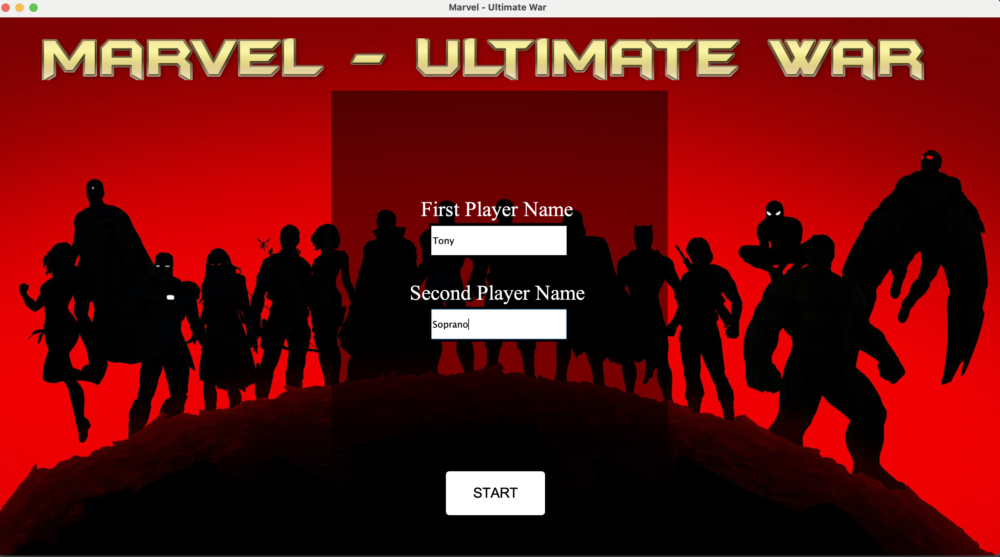
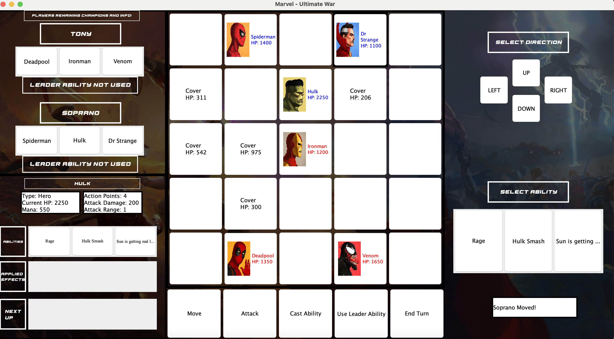

# Marvel Board Game
Marvel themed 2-player board game using Java and Swing, the objective of the game is to defeat your opponent's champions (obviously), players will exchange turns and in each turn will be able to choose from several possible actions.  
To download the game, clone this repository and run the Controller class.  

## Gameplay:

